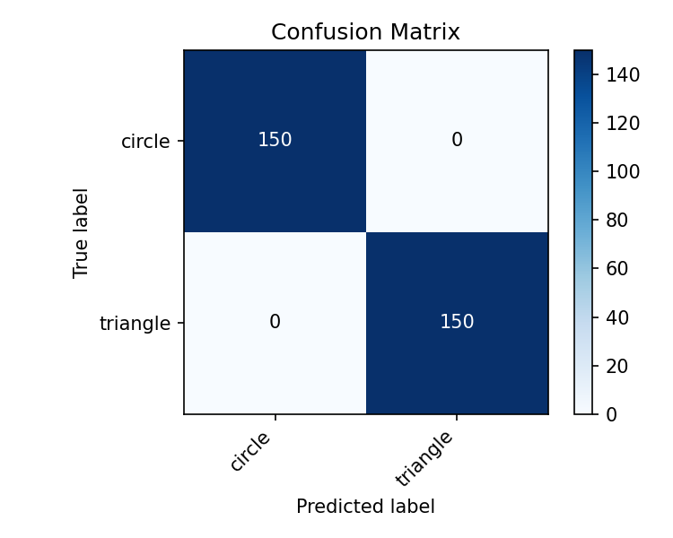
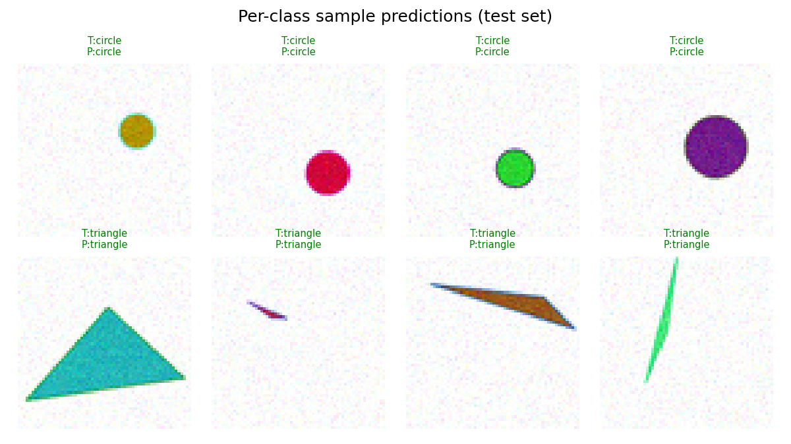

# ShapeClassifier

> **Learning project** — This project was mainly constructed in order to learn how to use [Claude Code](https://claude.ai/claude-code) (Anthropic's CLI) and AI-DLC, an AI-driven development lifecycle framework. The pipeline itself is a genuine end-to-end ML project and is presented here as a portfolio piece.

An end-to-end image classification pipeline that distinguishes **triangles** from **circles** using a custom CNN.
The dataset is fully synthetic — generated with `matplotlib` — making the project self-contained and 100 % reproducible.

---

## Motivation

This project demonstrates a complete ML workflow on image data:

- Synthetic dataset generation with controlled variation
- Image preprocessing and train / val / test splitting
- Custom CNN architecture built with PyTorch
- Evaluation: accuracy, F1-score, confusion matrix, per-class sample grid

---

## Tech Stack


---

## Project Structure

```
ShapeClassifier/
├── configs/
│   └── config.yaml          # All hyper-parameters in one place
├── data/
│   ├── raw/                 # Generated PNG images (triangle/, circle/)
│   ├── processed/           # Resized & normalised images
│   └── splits/              # train / val / test manifest CSVs
├── src/
│   ├── generate.py          # Synthetic image generation
│   ├── preprocess.py        # Transforms, augmentation, dataset splitting
│   ├── dataset.py           # PyTorch Dataset + DataLoader factory
│   ├── model.py             # GeometricCNN architecture
│   ├── train.py             # Training loop with early stopping
│   └── evaluate.py          # Metrics, confusion matrix, sample grid
├── tests/
│   ├── test_generate.py
│   ├── test_preprocess.py
│   └── test_model.py
├── requirements.txt
└── setup.py
```

---

## Pipeline

```
generate.py  →  preprocess.py  →  dataset.py  →  train.py  →  evaluate.py
    │                │                │               │              │
 raw PNGs       splits + CSVs    DataLoaders      checkpoint      metrics
```

**1. Generate** — draws triangles (3 random non-collinear points) and circles (random centre + radius) with randomised fill/edge colours and optional Gaussian noise.

**2. Preprocess** — resizes to a fixed resolution, normalises pixel values, applies optional augmentations (horizontal flip, colour jitter), and writes stratified train / val / test manifests.

**3. Dataset** — `GeometricDataset` reads manifests and serves `(tensor, label)` pairs to PyTorch `DataLoader`.

**4. Train** — configurable optimiser, LR scheduler (CosineAnnealing), and early stopping; saves the best validation checkpoint.

**5. Evaluate** — loads the checkpoint, runs inference on the test split, prints a `sklearn` classification report, and saves a confusion matrix and per-class sample prediction grid.

---

## Quick Start

```bash
# 1. Install dependencies
pip install -r requirements.txt

# 2. Generate the dataset (1 000 images per class by default)
python src/generate.py

# 3. Preprocess & split
python src/preprocess.py

# 4. Train
python src/train.py

# 5. Evaluate
python src/evaluate.py
```

All hyper-parameters (image size, number of samples, learning rate, …) live in [`configs/config.yaml`](configs/config.yaml).

### Running Tests

```bash
pytest tests/ -v
```

---

## Model

| Model | Description |
|---|---|
| `GeometricCNN` | 3-block conv-BN-ReLU-MaxPool network + AdaptiveAvgPool + FC head |

The model type is selected in `configs/config.yaml`:
```yaml
model:
  type: cnn
```

---

## Results

| Model | Test Accuracy | F1 (macro) |
|---|---|---|
| GeometricCNN | **1.00** | **1.00** |

_Trained for 18 epochs (early stopping) on 1 400 images, validated on 300, tested on 300._

### Confusion Matrix



### Per-class Sample Predictions



---

## Roadmap

- [x] Synthetic data generation
- [x] Preprocessing pipeline
- [x] PyTorch Dataset + DataLoader
- [x] GeometricCNN architecture
- [x] Training loop with early stopping
- [x] Evaluation: classification report + confusion matrix + sample grid
- [x] Unit tests
